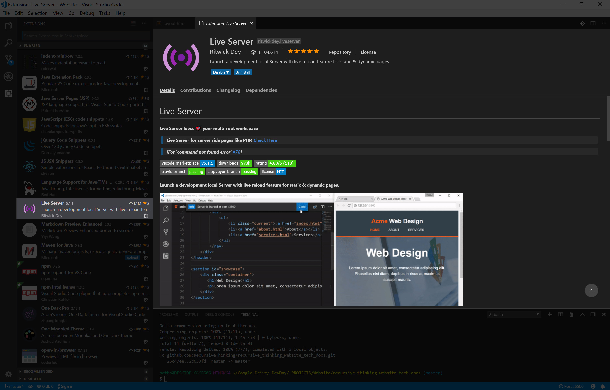
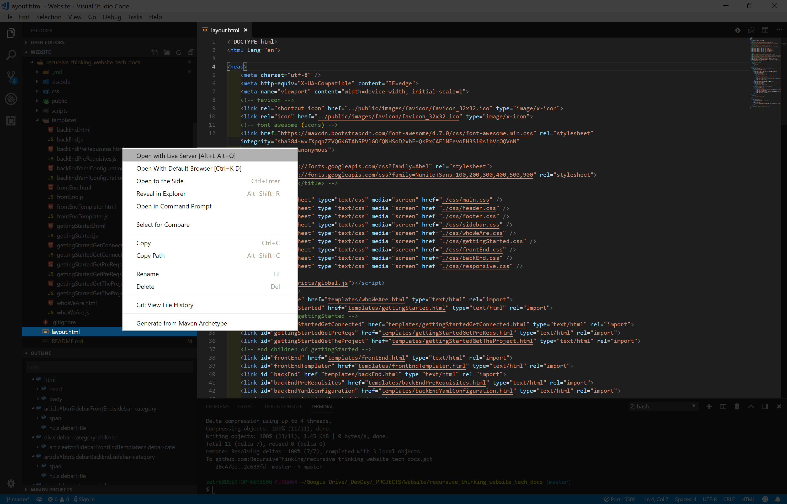
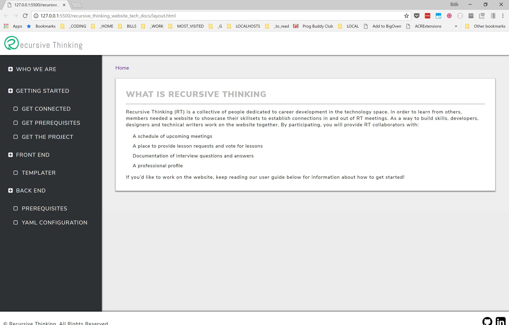

# Recursive Thinking Technical Document Website

This Repository holds a simple website which describes the process to get both the Front End and Back End of the Recursive Thinking Website up and running.
    
To Start, simply git clone this repository to your computer, and open layout.html inside a local development server.  

*Note - you can download - but downloading does not properly setup your connection between the remote and local repositories...so...don't download.
    
## To Clone the Project From Github:
    


-The following terminal command requires a basic knowledge of how to use a terminal/CLI (Command Line Interface).  Additionally, the git command requires the installation of Git ([Get Git Here](https://git-scm.com/)) on your system.
    
-If you have the above covered, Great!  Then go to the [recursive_thinking_website_tech_docs](https://github.com/RecursiveThinking/recursive_thinking_website_tech_docs) page and click on the clipboard/arrow button on the right side of the address link.
    
-Then, go to your terminal, and execute the following command:
    
```bash
git clone <paste your address here>
```

## To Startup the Site - Download an Local Development Extension - Live Server:

Note:  This is strictly (from what I know) a VSCode Extension.  If you are using a different IDE, you'll have to find a solution for that.  Good Luck!
    


## Open layout.html with Live Server:


## If you See this - You are Done:



