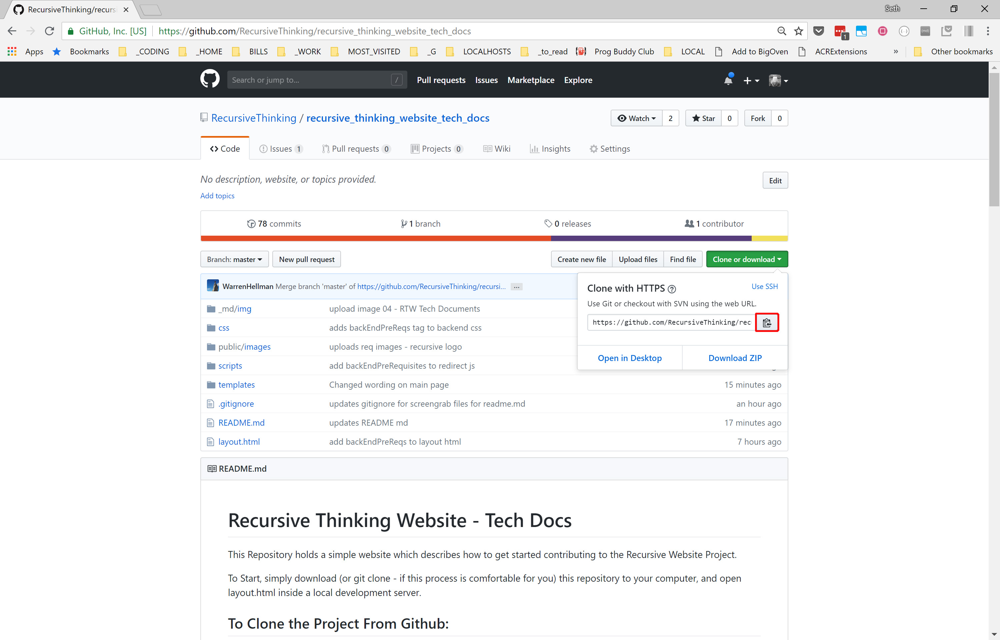

# Recursive Thinking Website - Tech Docs

This Repository holds a simple website which describes how to get started contributing to the Recursive Website Project.
    
To Start, simply download (or git clone - if this process is comfortable for you) this repository to your computer, and open layout.html inside a local development server.
    
## To Clone the File From Github:
    

## To Startup the Site - Download an Extension Like Live Server:

    Note:  This is strictly (from what I know) a VSCode Extension.  If you are using a different IDE, you'll have to find a solution for that.  Good Luck!
    

## Open layout.html with Live Server:

## If you See this - You are Done:

    

